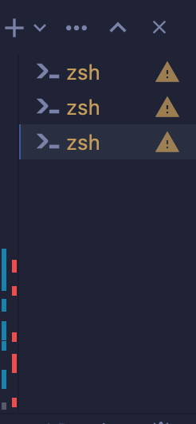
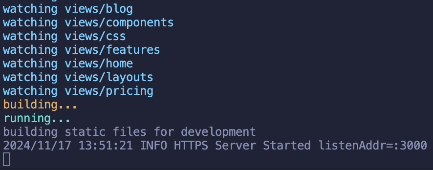
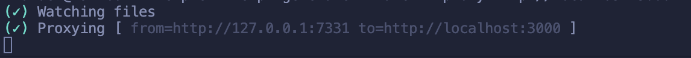
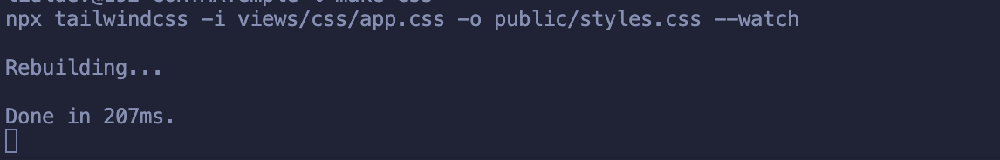

# GHHT

Golang + Htmx + Templ + Tailwind and Alpinejs and GUI created by using PinesUI

## How To Run Locally And Getting Upgrades Instantly

First clone this repo `git clone https://github.com/temidaradev/GHTT.git` and open 3 seperate terminal pages in your code editor like this:

Then for instant updates you should type:

1st `air`

2nd `templ generate --watch --proxy=http://localhost:3000`

3rd `make css`

Now it will update your website each time you save a file.
